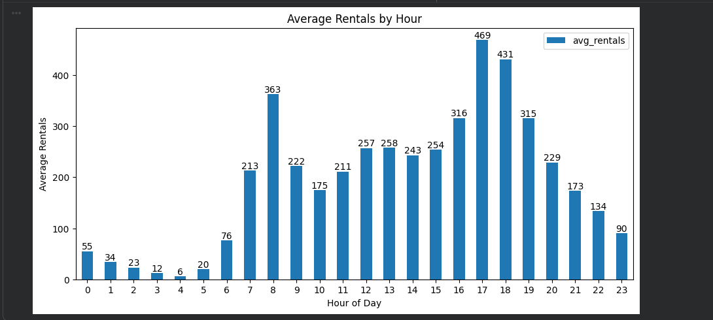
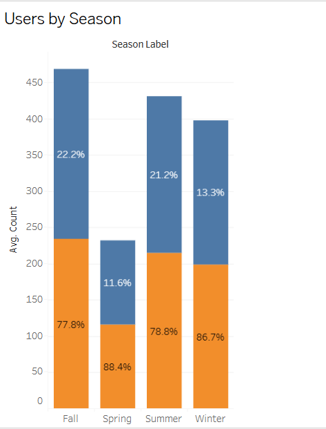
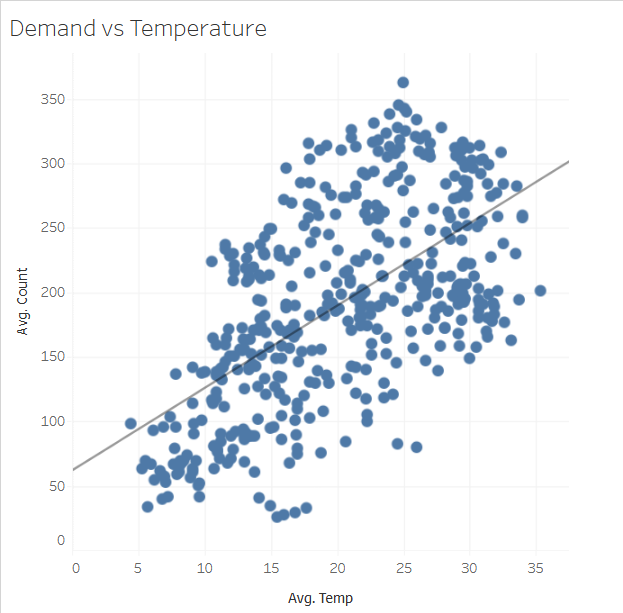
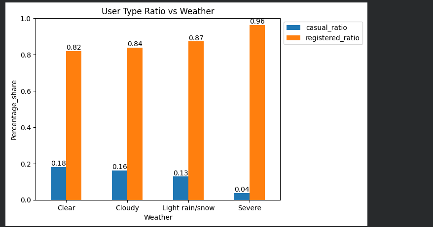
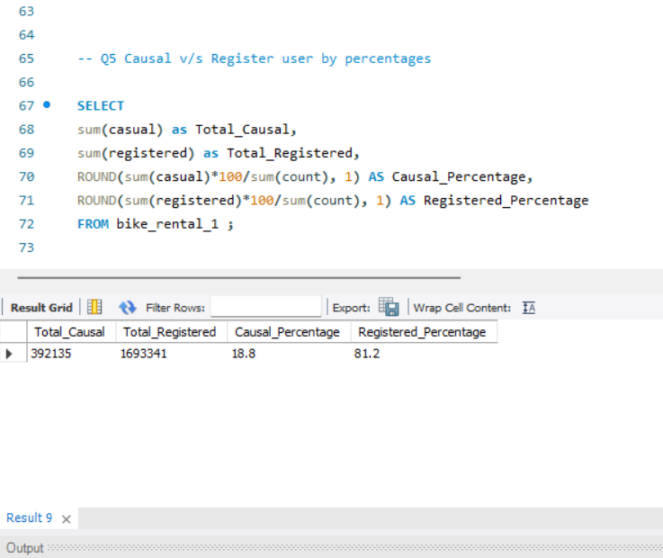
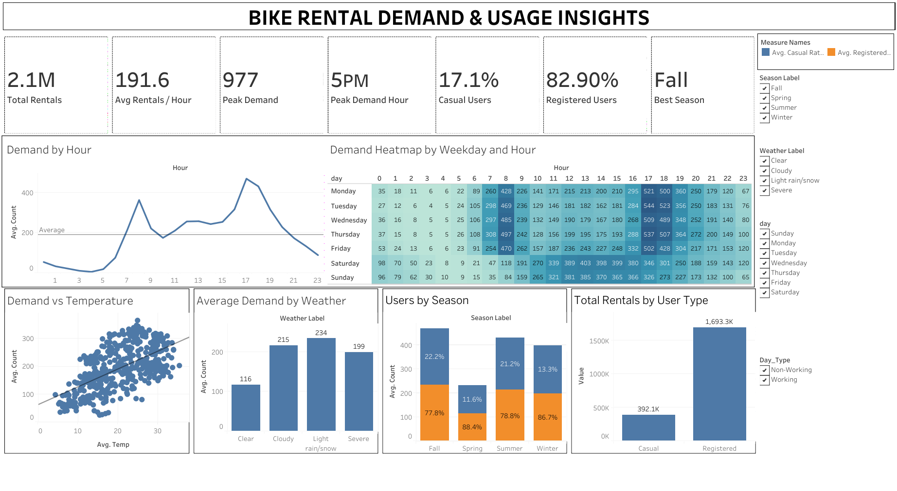

# Bike Rental Demand & Usage Analysis

### Data Analytics Project

An end-to-end data analytics project using **Python, SQL and Tableau** to understand the factors influencing bike rental demand and customer usage.

## Project Overview

This project analyzes historical bike rental data to understand how **time, season, temperature, weather and customer type** affect rental demand.

The dataset contains **10,886 hourly records** of bike rental activity.

The analysis follows this workflow:

**Raw Data → Python → SQL → Tableau → Business Insights → Recommendations**

## Business Objectives

The analysis focuses on:

- Identifying peak and low-demand rental hours
- Understanding seasonal rental demand
- Measuring the relationship between temperature and demand
- Understanding the impact of weather on customer behavior
- Comparing casual and registered customer usage
- Converting findings into practical business recommendations

## Tools & Technologies

- **Python** — Data preparation, feature engineering and exploratory analysis
- **Pandas & NumPy** — Data manipulation and analysis
- **SQL** — Business analysis and validation
- **Tableau** — Interactive dashboard and visualization
- **Excel** — Data source and preparation

## Data & Methodology

The dataset contains hourly bike rental activity with information on:

- Date and time
- Rental count
- Casual and registered users
- Season
- Weather
- Temperature
- Humidity
- Windspeed
- Working day and holiday information

Python was used to prepare the data, create additional fields and perform exploratory analysis.

SQL was used to answer business questions through aggregations, comparisons and validation.

Tableau was used to create the final interactive dashboard.

A key data validation check confirmed:

**Casual Rentals + Registered Rentals = Total Rentals**

The dataset passed the required data-quality checks before analysis. :contentReference[oaicite:2]{index=2}

# Key Findings

## Finding 1 — Rental Demand Peaks During Specific Hours

Rental demand varies significantly throughout the day.

The main peak periods identified were:

- **Morning: 7–9 AM**
- **Evening: 4–7 PM**

The analysis also identified **9 PM–5 AM** as a low-demand period suitable for maintenance planning.

### Business Meaning

High-demand periods require stronger bike availability, while maintenance activities can be scheduled during lower-demand hours to reduce disruption during peak rental periods. :contentReference[oaicite:3]{index=3}

## Finding 2 — Rental Demand Varies by Season

**Fall** records the highest average rental demand, followed by **Summer, Winter and Spring**.

The customer mix also changes across seasons, while registered customers remain relatively consistent.

### Business Meaning

Higher-demand seasons create opportunities for stronger capacity planning, while lower-demand periods such as Spring provide opportunities for seasonal promotions, particularly for casual customers. :contentReference[oaicite:4]{index=4}

## Finding 3 — Temperature Is Positively Associated With Demand

Temperature has a positive relationship with rental demand, with a correlation of approximately **+0.394**.

Average demand reaches around **334 rentals** in the **30–40°C** temperature range.

### Business Meaning

Temperature can be considered alongside time, season and weather when planning bike availability and operating decisions. :contentReference[oaicite:5]{index=5}

## Finding 4 — Weather Strongly Affects Casual User Participation

Casual users become less active as weather conditions become worse.

| Weather | Casual User Share |
|---|---:|
| Clear | 18% |
| Cloudy | 16% |
| Light Rain/Snow | 13% |
| Severe | 4% |

Registered users remain the dominant customer segment across weather conditions.

### Business Meaning

Casual customers are more sensitive to unfavorable weather, creating an opportunity for weather-based promotions during favorable conditions, while registered customers remain the core customer segment. :contentReference[oaicite:6]{index=6}

## Finding 5 — Registered Users Dominate Overall Rentals

Registered users account for **81.2%** of total rentals, while casual users account for approximately **18.8%**.

### Business Meaning

Registered customers are the core source of rental activity. This creates opportunities for customer retention and for converting casual users into registered customers. :contentReference[oaicite:7]{index=7}

# Tableau Dashboard

The final Tableau dashboard combines the key KPIs and visualizations into one interactive business view.

The dashboard provides:

- Overall Performance: Total Rentals and Average Rentals per Hour
- Peak Demand: Peak Rental Demand and Peak Demand Hour
- Seasonality: Best Season
- Demand Patterns: Demand by Hour and Weekday/Hour Heatmap
- Environmental Factors: Demand vs Temperature and Average Demand by Weather
- Customer Analysis: Users by Weather and Rentals by User Type
- Interactive filters for exploring the data

The dashboard allows the user to explore rental demand patterns and customer behavior through interactive visualizations. :contentReference[oaicite:8]{index=8}

# Actionable Recommendations

## 1. Capacity & Maintenance Planning

Keep sufficient bike availability during the **7–9 AM and 4–7 PM** demand peaks.

Schedule maintenance during lower-demand periods, particularly between **9 PM and 5 AM**.

This can help reduce missed rental opportunities while keeping maintenance work away from peak demand.

## 2. Seasonal Capacity & Promotions

Prepare additional bike and staff capacity for higher-demand seasons, particularly **Fall and Summer**.

Use promotions or seasonal packages during lower-demand periods such as **Spring**.

This can help improve bike utilization across different seasons.

## 3. Temperature-Based Planning & Operations

Include temperature alongside time, season and weather when planning operations.

When conditions are favorable, adjust operating capacity and service levels to capture additional demand.

This can help align operations with changes in temperature-driven demand.

## 4. Weather-Based Casual Customer Strategy

Target casual customers during favorable weather conditions through focused offers or weekend promotions.

Registered customers should remain a priority for retention because they continue to provide the majority of rentals across weather conditions.

This can help increase casual rentals while protecting the core registered customer base.

## 5. Customer Retention & Membership Conversion

Maintain retention and loyalty initiatives for registered customers, who account for **81.2% of total rentals**.

Introduce membership trials or introductory plans to encourage casual customers to become registered users.

This can help strengthen the recurring customer base and increase registered-user participation. :contentReference[oaicite:9]{index=9}

# Project Files

| File | Description |
|---|---|
| `Bike-Rental-Analysis` | Python data preparation and analysis |
| `Bike-Rental-Analysis- SQL` | SQL business analysis |
| `Bike_Rental_Final_Report` | Complete project report |
| `Bike-Rental-Dashboard` | Tableau dashboard |
| `visuals/` | Key findings and dashboard visuals |

# Conclusion

The analysis shows that bike rental demand is strongly influenced by **time of day, season, temperature, weather and customer type**.

Demand is concentrated around the morning and evening peak periods, while Fall and Summer show stronger seasonal demand. Temperature has a positive association with demand, while unfavorable weather has a stronger effect on casual customers.

Registered users account for **81.2% of total rentals**, making them the core customer segment.

Overall, the project converts bike rental data into practical business insights covering **capacity planning, maintenance scheduling, seasonal planning, weather-based marketing, customer retention and membership conversion**. :contentReference[oaicite:10]{index=10}
