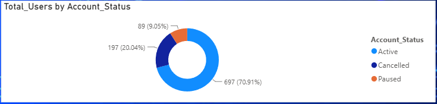
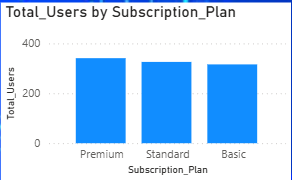
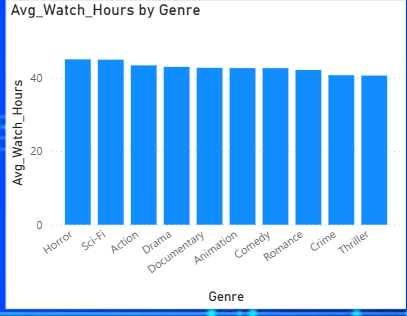
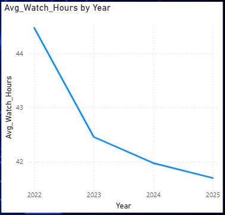
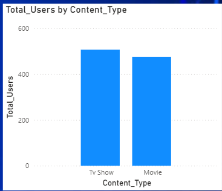
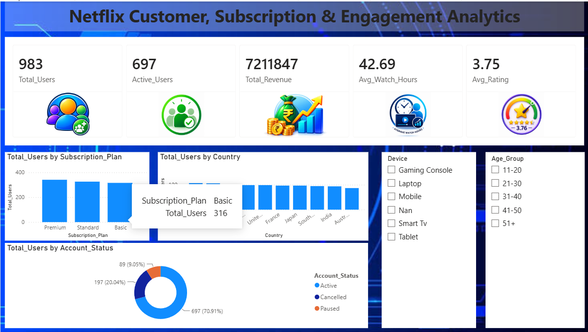
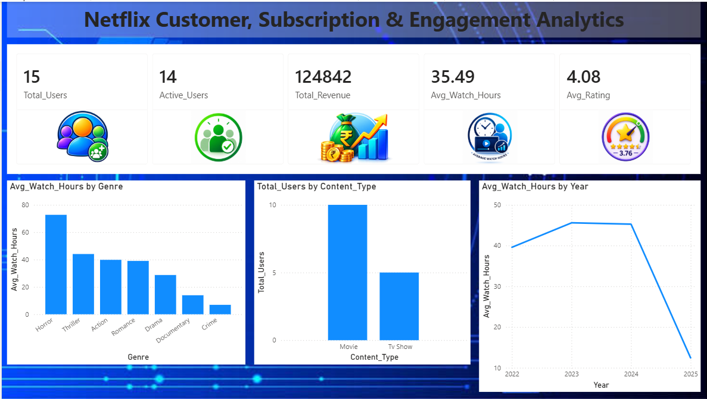

# Netflix Customer, Subscription & Engagement Analytics

### Using Simulated Customer Data

## Project Overview

This project analyzes simulated Netflix customer data to understand customer behavior, subscription patterns, content preferences and viewing engagement.

The project uses Python for data cleaning and analysis, SQL for business analysis, and Power BI for dashboard visualization.

## Business Objectives

The analysis focuses on:

- Customer account status and retention
- Subscription plan distribution
- Customer viewing behavior across genres
- Changes in average watch hours over time
- Customer usage of Movies and TV Shows
- Customer engagement and content preferences

## Tools & Technologies

- Python
- Pandas
- NumPy
- SQL
- Power BI
- Excel

## Data & Methodology

The project follows this workflow:

**Raw Data → Python → SQL → Power BI → Insights → Recommendations**

Python was used for data cleaning, preparation and analysis. SQL was used for business analysis and aggregations. Power BI was used to create an interactive dashboard and present the key results.

The dataset used in this project is simulated/dummy data created for analytical and portfolio purposes.

# Key Findings

## Finding 1 — Customer Account Status

The analysis identified **697 active customers, 89 paused customers and 197 cancelled customers**.

### Business Meaning

The active customer base provides a strong foundation for continued engagement. The paused customer segment represents an opportunity for reactivation, while the cancelled customer segment provides an opportunity to understand customer loss and reduce future cancellations.

## Finding 2 — Subscription Plans

The **Premium plan has 341 customers**, followed by **Standard with 326** and **Basic with 316 customers**.

The difference between Premium and Basic is only **25 customers**, showing that customers are relatively evenly distributed across the three subscription tiers.

### Business Meaning

Premium has the largest customer base among the three plans. The relatively balanced distribution across the plans also provides an opportunity to increase Premium adoption among suitable customers.

## Finding 3 — Average Watch Hours by Genre

Customers spend the most time watching **Horror (45 hours)** and **Sci-Fi (44.91 hours)**.

Average watch hours across genres range from **41.58 to 45 hours**, a difference of only **3.42 hours**, showing that viewing time is relatively consistent across genres.

### Genre Performance

| Genre | Average Watch Hours |
|---|---:|
| Horror | 45.00 |
| Sci-Fi | 44.91 |
| Action | 43.36 |
| Drama | 42.94 |
| Documentary | 42.70 |
| Animation | 42.61 |
| Comedy | 42.60 |
| Romance | 42.08 |
| Crime | 41.68 |
| Thriller | 41.58 |

### Business Meaning

Horror and Sci-Fi show the strongest viewing engagement, while Thriller and Crime have comparatively lower average watch hours. These differences provide useful insight into customer content consumption and engagement.

## Finding 4 — Average Watch Hours Over Time

Average watch hours declined from **44.47 hours in 2022 to 41.70 hours in 2025**.

| Year | Average Watch Hours |
|---|---:|
| 2022 | 44.47 |
| 2023 | 42.45 |
| 2024 | 41.97 |
| 2025 | 41.70 |

The decline was **2.02 hours from 2022 to 2023**, followed by smaller decreases of **0.48 hours from 2023 to 2024** and **0.27 hours from 2024 to 2025**.

### Business Meaning

The continued decline shows that customer viewing activity needs attention. However, the smaller year-over-year decreases indicate that the rate of decline is slowing over time.

## Finding 5 — TV Shows vs Movies

TV Shows have **507 users (51.6%)**, while Movies have **476 users (48.4%)**.

The difference is only **31 users**, showing that customer usage is relatively balanced between the two content types.

### Business Meaning

TV Shows have a slight usage advantage, but customers consume both TV Shows and Movies. Maintaining variety across both content types is therefore important for meeting different customer viewing preferences.

# Power BI Dashboard

The Power BI dashboard brings together the key metrics and visualizations from the analysis into an interactive business view.

The dashboard provides a view of:

- Overall Performance: Total Users, Active Users, Total Revenue, Average Watch Hours and Average Rating
- Customer Analysis: Users by Subscription Plan, Country and Account Status
- Content Analysis: Average Watch Hours by Genre and Users by Content Type
- Engagement Trends: Average Watch Hours by Year
- Interactive Filters: Device and Age Group

### Dashboard Page 1 — Customer & Subscription Analysis

### Dashboard Page 2 — Content & Engagement Analysis

# Actionable Recommendations

## 1. Customer Retention & Reactivation

Customer Retention & Reactivation should focus on the **697 active customers** through relevant content and continued engagement. The **89 paused customers** provide an opportunity for reactivation, while the **197 cancelled customers** provide an opportunity to understand and reduce customer loss.

This can help **retain the existing customer base, recover inactive customers and reduce cancellations**.

## 2. Premium Subscription Growth

Premium Subscription Growth should build on the **341 Premium customers**, compared with **326 Standard** and **316 Basic customers**.

This can help **increase Premium adoption and strengthen subscription revenue**.

## 3. High-Engagement Content Focus

High-Engagement Content Focus should give greater importance to **Horror (45 hours)** and **Sci-Fi (44.91 hours)**, which have the highest average watch hours.

This can help **maintain strong viewing engagement and support stronger content performance**.

## 4. Improve Viewing Engagement

Average watch hours declined from **44.47 hours in 2022 to 41.70 hours in 2025**.

Maintaining relevant and engaging content can help **stabilize viewing activity and protect customer engagement**.

## 5. Balanced Content Strategy

TV Shows have **507 users (51.6%)**, while Movies have **476 users (48.4%)**, a difference of only **31 users**.

Maintaining a balanced content mix can help **serve different customer preferences and maintain broad content appeal**.

# Project Files

| File | Description |
|---|---|
| [Final Report](Netflix_Final_Report.pdf) | Complete project report |
| [Python Analysis](Netflix-Analysis.ipynb) | Python data cleaning, preparation and analysis |
| [SQL Analysis](Netflix-Analysis.sql) | SQL-based business analysis |
| [Power BI Dashboard](Netflix-Dashboard.pbix) | Interactive Power BI dashboard |

# Conclusion

The analysis shows that customer behavior is influenced by **account status, subscription plan, genre, viewing time and content type**.

The customer analysis identified **697 active, 89 paused and 197 cancelled customers**, creating opportunities for stronger customer retention, reactivation and churn reduction. Subscription analysis showed that **Premium has the highest customer base with 341 customers**, followed by Standard with 326 and Basic with 316.

Content analysis showed stronger engagement with **Horror (45 hours)** and **Sci-Fi (44.91 hours)**, while average watch hours declined from **44.47 hours in 2022 to 41.70 hours in 2025**. The content-type analysis also showed a balanced preference between **TV Shows (507 users)** and **Movies (476 users)**.

Overall, the project converts simulated customer data into practical business insights and actionable recommendations covering **customer retention, reactivation, subscription growth, content engagement, viewing activity and content strategy**.
